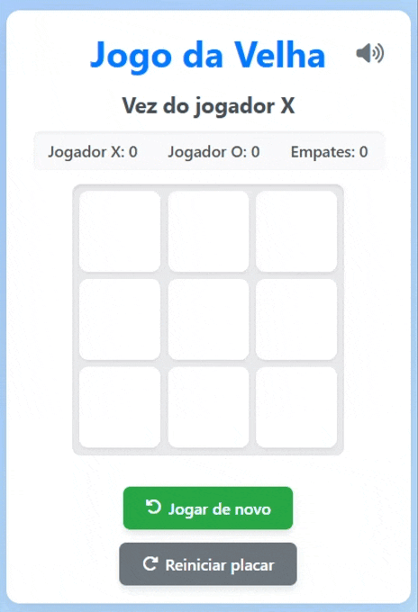

# 🎮 Jogo da Velha (Tic Tac Toe)

Projeto simples de Jogo da Velha desenvolvido com HTML, CSS e JavaScript. Dois jogadores se revezam clicando nas células do tabuleiro até que haja um vencedor ou empate.


---

## 📌 Funcionalidades

- Tabuleiro 3x3
- Dois jogadores locais (sem IA)
- Verificação automática de vitória ou empate
- Animações com confete e fogos de artifício para vitória
- Sons diferentes para vitória e empate usando a biblioteca [Howler.js](https://howlerjs.com/)
- Opção para mutar o jogo
- Botão de reiniciar partida
- Design responsivo e interativo

---

## 🚀 Tecnologias Utilizadas

- HTML5
- CSS3
- JavaScript (ES6+)
- [Howler.js](https://howlerjs.com/) (efeitos sonoros)
- [Canvas Confetti](https://www.kirilv.com/canvas-confetti/) (efeitos visuais)

---

## 📁 Estrutura de Pastas

```
tic-tac-toe/
├── index.html
├── style.css
├── script.js
├── sounds/
│ ├── victory-sound.wav
│ └── draw.mp3
```

## 🛠️ Como executar o projeto

1. Clone este repositório:
   ```bash
   git clone https://github.com/mirraelly/tic-tac-toe
   ```
2. Abra o projeto com Live Server no VS Code ou outro servidor local.

3. Clique nas células para jogar!

## Objetivo do Projeto

- Praticar lógica de programação com JavaScript puro
- Aplicar eventos de DOM e manipulação de estado
- Explorar bibliotecas externas para enriquecer a experiência do usuário

## 📷 Demonstração

<p align="center">
  
</p>

<p align="center">
  
</p>

## 📄 Licença

Este projeto está licenciado sob a licença MIT.

## 🙋‍♀️ Desenvolvedora

- [LinkedIn](https://www.linkedin.com/in/mirraelymoura/)
- [Instagram](https://github.com/mirraelly)
- [GitHub](https://github.com/mirraelly)
